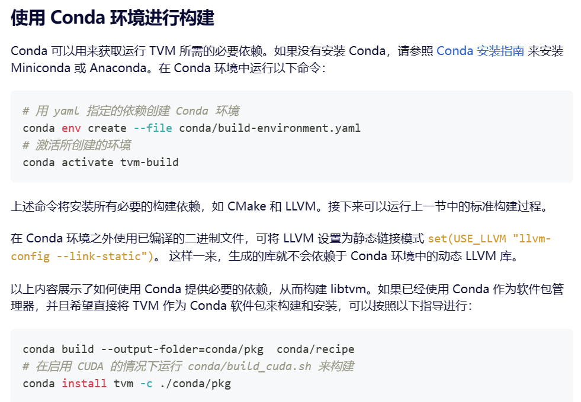

%% Target：简单跑起来%%

## 准备环境

1. **装Ubuntu（所谓linux环境）**

   如何通过wsl在windows电脑上使用ubuntu？
   先看：[安装 WSL | Microsoft Learn](https://learn.microsoft.com/zh-cn/windows/wsl/install)
   安装成功后：[设置 WSL 开发环境 | Microsoft Learn](https://learn.microsoft.com/zh-cn/windows/wsl/setup/environment)
2. **更换镜像源**（为了方面后面下载东西快一点）

   教程很多，根据步骤找找就行
   [Linux换国内镜像源(Ubuntu、Debian等)_linux jingxiangyuan-CSDN博客](https://blog.csdn.net/qq_40520596/article/details/110194439)
3. **安装Anaconda** ，方便后面装python，下东西以及配置conda。把VTM 构建共享库（方法二）完成之后再装也没问题

   官方教程: [Installing conda — conda 24.3.1.dev77 documentation
   或者 直接百度也没问题](https://docs.conda.io/projects/conda/en/latest/user-guide/install/)

## TVM安装

> 主要参考
>
> - 官方手册 [Apache TVM Documentation — tvm 0.17.dev0 documentation](https://tvm.apache.org/docs/)
> - **中文手册** [从源码安装 | Apache TVM 中文站 (hyper.ai)](https://tvm.hyper.ai/docs/install/from_source)
> - **博客教程** [ubuntu18.04 TVM编译安装](https://www.cnblogs.com/wangtianning1223/p/14250470.html "发布于 2021-01-08 11:11")
> - 重点参考了后面两个，注意中文版的层级关系有关乱，可能会混淆安装步骤之间的并列关系。一旦有迷惑的地方还是要看一下英文原版
> - TVM的安装手册里写了很多情况但是不用都看懂，先按照操作执行就可。

### 1. **从源码下载tvm**

   在ubuntu下命令行直接安装
   `git clone --recursive https://github.com/apache/tvm tvm`

> 下载好之后应该在自己的目录下会有一个TVM文件夹

   安装依赖工具，首先监测更新，再安装

```bash
sudo apt-get update 

sudo apt-get install -y python3 python3-dev python3-setuptools gcc libtinfo-dev zlib1g-dev build-essential cmake libedit-dev libxml2-dev
```

> 一般来说不太会有问题，有问题的话百度一般都能解决，可能会需要 `sudo apt upgrade`
> 之前装过一些包也不要紧，安装的时候会自动检查然后跳过的

### 2. 构建共享库

   这里有两种方法：使用Conda或者自己装。我用了方法二，但是好像方法一也比较方便，感兴趣可以看看

#### 方法一：**使用Conda构建环境**（我装完才发现好像这个方法更容易，可以尝试）

   

#### 方法二：手动档安装 ，也不麻烦，可能风险是直接下载的python版本是3.9，tvm不支持，后续通过创建conda环境解决

1. **LLVM安装**
   参考教程：[ubuntu18.04 TVM编译安装 - Wangtn - 博客园 (cnblogs.com)](https://www.cnblogs.com/wangtianning1223/p/14250470.html)

   LLVM下载地址：[https://releases.llvm.org/download.html](https://releases.llvm.org/download.html)

   - LLVM有很多发布的版本，直接从源码开始安装下载时间比较长，所以我们选择**Pre-Built Binaries 版本**

     首先，查看自己的ubuntu系统版本
     `lsb_release -a`

     我的是20.04，直接在下载界面搜ubuntu，发现llvm11.0.1有，于是下载
   - 一般来说是下载到本地目录（例如我是D盘的Download）,从本地目录拷贝到ubuntu里，推荐 `mkdir llvm`，或者自己建立tools文件夹来管理这些工具

   ```C
   cp -r \mnt\d\Download\cling&&&.tar.xz \自己的llvm目录
   ```

   - 解压以及配置流程参见教程[ubuntu18.04 TVM编译安装 - Wangtn - 博客园 (cnblogs.com)](https://www.cnblogs.com/wangtianning1223/p/14250470.html)，图片只是示例
     

     > 这里可能需要了解一些**vim编辑器**的使用方法。直接百度：vim如何编辑
     >

     - 运行并检查是否成功
       
2. **构建TVM的共享库**

   第一步，在 `\TVM`的目录下面新建一个build文件夹，把 `\tvm\cmake`文件夹里的 `config.cmake`拷贝到 `\tvm\build`下
   具体代码： **教程里的sudo理论上不需要每次都添加，原因可以去百度sudo**

   第二步，修改build文件夹中的config.cmake文件，将如下选项改为ON
   

   第三步，构建TVM以及相关库（这步时间可能会很长）
   

```c
  cmake ..
  make -j4
```

> [!important] 重要提示
> 如果这一步成功了，会看到 _libtvm.so_ 和 _libtvm_runtime.so_
> 之后直接跳转到 **Python 包的安装** 这一节，不需要再执行教程里使用Conda构建环境了。

#### 3. python包的安装

第一步，首先利用conda新建一个python=3.7的环境

```bash
conda creat -n your_tvm_name python=3.7`
```

成功后使用

```c
conda activate your_tvm_name
```

激活环境，可以看到

第二步，修改python环境变量


> 官网有两种方法，这里用了第一种，记得修改完之后要 `source ~/.bashrc`激活一下

第三步，安装必要的依赖

```c
pip3 install --user numpy decorator attrs
```

可能会遇到的问题是找不到，基本就是网络原因。换个热点或者把梯子关掉。

## 快速测试

> 官网的测试整合在用户手册里，但其实如果安装过程中不报错基本上没什么问题。但是为了心安还是可以快速简单测试一下。

快速测试方法：使用python，检查能否正常import tvm

如果这里不报错，说明tvm已经可以用了

- 但遇到了报错1：`# OSError: /home/cc/anaconda3/bin/../lib/libstdc++.so.6: version GLIBCXX_3.4.30' not found (required by /home/cc/tvm/build/libtvm.so)`
  解决办法：

  1. 定位：error写找不到，一般原因是 `libstdc++`版本不是最新的，导致找不到 `GLIBCXX_3.4.30`
  2. 确认问题：检查下现在lib里的版本
     `strings /home/cc/anaconda3/envs/tvm_base/lib/libstdc++.so.6 | grep GLIBCXX`

  
  发现确实最高到29，但是系统需要的是3.4.30，需要update
  3. 解决：升级
  这里面情况很多，建议是百度一下（注意要找报错版本一样的解决方案），然后挨着试
  首先试试升级gcc `sudo apt-update gcc`
  或者 `sudo apt-get install libstdc++6`
  或者 `conda install -c conda-forge libstdcxx-ng=12` （我是这个成功了）

## 恭喜

到这里，恭喜你已经基本完成了环境搭建。后续请继续按照文档进行学习吧~
